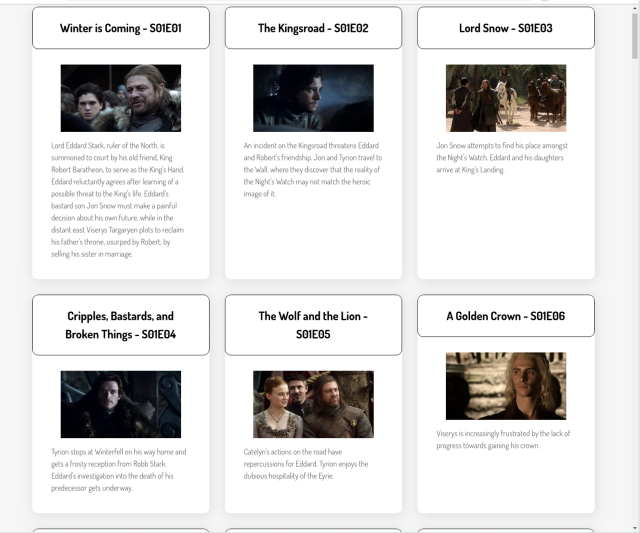

# Level 100

For level 100, we are going to display information about every episode of a single TV show.

## Requirements

1. All episodes must be shown
2. For each episode, _at least_ following must be displayed:
   1. The name of the episode
   2. The season number
   3. The episode number
   4. The medium-sized image for the episode
   5. The summary text of the episode
3. Combine season number and episode number into an **episode code**:
   1. Each part should be zero-padded to two digits.
   2. Example: `S02E07` would be the code for the 7th episode of the 2nd season. `S2E7` would be incorrect.
4. Your page should state somewhere that the data has (originally) come from [TVMaze.com](https://tvmaze.com/), and link back to that site (or the specific episode on that site). See [tvmaze.com/api#licensing](https://www.tvmaze.com/api#licensing).

### Screenshot of minimal version

Note: Provided your project meets the above requirements, it can **look** however you want. Do the simplest thing to begin with.

Here is one example layout.

____________________________________CODE EXPLANATION LEVEL-100________________________________________________

What’s Level-100 About?
Level-100 is the most basic version of our project. At this level, we’re focused on:

Displaying static content (TV episodes) on a webpage.
Learning how to structure and style the webpage using HTML, CSS, and JavaScript.
Getting comfortable with how JavaScript can manipulate the content on a webpage.
It’s like building the foundation of a house – no fancy features, just the basic structure. 🏠

What Does the Website Do?
At Level-100:

The website displays a list of TV episodes.
Each episode shows:

A title (e.g., "Winter Is Coming")
The season and episode number (e.g., "S01E01")
An image (a thumbnail for the episode)
A short description (summary of the episode)
The episodes are displayed in a simple grid layout, like cards.

How Does the Code Work?
Let’s break it into parts!

1. Static Data
We have a file called episodes.js, which contains all the information about the TV episodes. This data is already written for us, so we don’t have to create it from scratch.

Here’s what one episode looks like in the data:

javascript code:

{
  id: 1,
  name: "Winter Is Coming",
  season: 1,
  number: 1,
  summary: "The episode introduces the Starks of Winterfell and their family.",
  image: { medium: "https://imageurl.com/example.jpg" }
}

This is like a recipe card that gives us everything we need to show an episode:

name: The title of the episode.
season and number: Tell us the season and episode numbers.
summary: A short description of the episode.
image: A picture for the episode.

2. Setting Up the Webpage

The webpage starts with an empty div in the HTML file that looks like this:

html code: 

This div is like an empty container, and we’re going to use JavaScript to "fill it up" with episode cards.

3. JavaScript: Rendering Episodes

Now comes the fun part – JavaScript! 
This is where we take the data from episodes.js and display it on the webpage.

Here’s the main function that does the job:

JavaScript code: 

function renderAllEpisodes(episodeList) {
  const rootElem = document.getElementById("root"); // Find the empty container in the HTML
  const displayHTML = episodeList
    .map(
      (episode) => `
        

          <h3>${episode.name} – S${String(episode.season).padStart(2, "0")}E${String(
        episode.number
      ).padStart(2, "0")}</h3>
          
          
${episode.summary || "No summary available."}

        

      `
    )
    .join(""); // Combine all episodes into one big string of HTML
  rootElem.innerHTML = displayHTML; // Display the episodes on the webpage
}

Breaking It Down

Step 1: Get the Empty Container
We use document.getElementById("root") to grab the empty div from the HTML file. This is where we’ll put all our episode cards.

Step 2: Create HTML for Each Episode
We loop through the episodeList (the array of episodes) using .map() and create some HTML for each episode. Each episode card has:

A title: Includes the episode name and season/episode number (e.g., S01E01).
An image: Uses the episode’s image URL.
A summary: Displays the short description.

Step 3: Combine the HTML
.join("") combines all the episode cards into one big block of HTML.

Step 4: Display the HTML
Finally, we set the innerHTML of the rootElem to the big block of HTML. This is what makes the episodes appear on the screen!

4. Making it Look Good (CSS)
In the Level-100 implementation, we also use CSS to style the webpage. For example:

We create a grid layout so that episodes are shown in rows and columns.
Each episode card has some spacing, padding, and a nice border.
Here’s what a basic CSS rule might look like:

css code: 

.episode-card {
  border: 1px solid #ddd;
  padding: 10px;
  margin: 10px;
  text-align: center;
}
This makes each episode card look neat and organized.

5. Putting It All Together
When the webpage loads:

We call the getAllEpisodes() function to get all the episode data.
We pass that data to renderAllEpisodes().

The function generates the HTML for the episodes and displays it on the page.
The user sees a grid of episode cards with titles, images, and descriptions.

What’s the Goal of Level-100?
The goal is to practice the basics:

HTML: Structure the webpage using div, h3, p, and img tags.
CSS: Style the content with spacing, borders, and layouts.
JavaScript: Use JS to dynamically generate and display content on the webpage.

Key Takeaways

I personaly understood that we don’t need to hardcode everything in HTML.
JavaScript can dynamically create and display content for us.
Learn how to work with arrays in JavaScript (e.g., map(), join(), etc.).
Keep things simple!
Level-100 is all about understanding the foundation before adding more advanced features later.