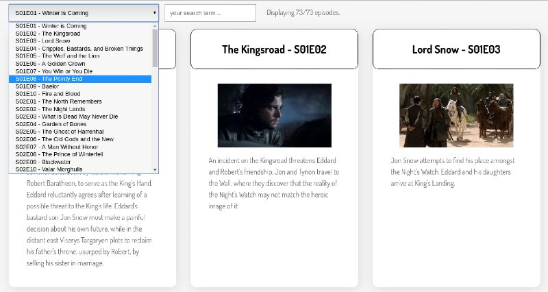

# Level 200

For level 200, you are not allowed to work on the same codebase as you worked on for level 100.

Swap repos with a random person in your class. You do not need to coordinate your schedules.

Fork their GitHub repository to your GitHub username. You will need to give it a different name (e.g. `Project-TV-Show-Partner`), because you already have a repo named `Project-TV-Show`.

Clone their repository to your laptop.

Look at their level 100 implementation.

Compare their implementation to yours. Think:
1. How is it different?
2. What do you prefer about your implementation?
3. What do you prefer about their implementation?
4. What did you learn that you didn't know before?

They should do the same with your repository.

Have a discussion about your answers to these questions. In class, together you should give talk for 5 minutes about your conclusions. (Do this in small groups - we don't want to take all day).

## Refactoring

**Before implementing new features**, take some time to change the codebase you're going to build level 200 in. Change anything you think will make it easier to add more features.

Some example ideas that you may want to think about:
1. Could any variables or functions have more clear names, to help you understand what they do?
2. Would [extracting functions](https://code.visualstudio.com/docs/editor/refactoring) help make some code easier to understand?

Make a pull request to your partner's repo with any changes you want to make. Have them review, and when happy, merge your PR.

## Adding new functionality

Level 200 is all about being able to filter episodes.

### Search

Add a live search input which meets the following requirements:

When a user types a search term into the search box:
1. Only episodes whose summary **OR** name contains the search term should be displayed
2. The search should be case-**in**sensitive
3. The display should update **immediately** after each keystroke changes the input
4. Display how many episodes match the current search
5. If the search box is cleared, **all** episodes should be shown

Send a pull request to your partner's repo with this functionality. Have them review, and when happy, merge your PR.

#### Screenshot of minimal version

Note: Provided your project meets the above requirements, it can **look** however you want.

Here is one example layout.

### Episode selector

Add a `select` drop-down which lets the user jump quickly to a particular episode, with the following requirements:
1. The select input should list all episodes in the format: "S01E01 - Winter is Coming"
2. When the user makes a selection, they should be taken directly to that episode in the list
3. Bonus: if you prefer, when the select is used, ONLY show the selected episode. If you do this, be sure to provide a way for the user to see all episodes again.

Send a pull request to your partner's repo with this functionality. Have them review, and when happy, merge your PR.

#### Screenshot of minimal version

Note: Provided your project meets the above requirements, it can **look** however you want.

Here is one example layout.

_________________________________________CODE EXPLANATION LEVEL-200_____________________________________

In Level-200, 
we used static data (data stored in a JavaScript file called episodes.js) to display a list of TV episodes on a webpage. We added interactivity with:

A search bar to filter episodes by name or description.
A dropdown menu to select and display a specific episode.

How Does it Work?
Let’s break it into steps:

1. Loading the Static Data
Unlike Level-300 (where data comes from the internet), in Level-200, the episode data is already stored in a file called episodes.js. This file contains a function, getAllEpisodes, that returns an array of objects. Each object represents an episode, with details like:

Episode name
Season number
Episode number
Summary (a short description of the episode)
An image URL
For example, an episode object might look like this:

javascript code: 
{
  id: 1,
  name: "Winter Is Coming",
  season: 1,
  number: 1,
  summary: "The episode introduces the Starks of Winterfell and their family.",
  image: { medium: "https://imageurl.com/example.jpg" }
}

2. Rendering the Episodes

When the webpage loads, we display all the episodes in the browser. Each episode is shown as a card with its:

Title
Season/Episode Number
Image
Description
Here’s the function that handles this:

javascript code:

function renderAllEpisodes(episodeList) {
  const rootElem = document.getElementById("root");
  const displayHTML = episodeList
    .map(
      (episode) => `
        

          <h3>${episode.name} – S${String(episode.season).padStart(2, "0")}E${String(
        episode.number
      ).padStart(2, "0")}</h3>
          
          
${episode.summary || "No summary available."}

        

      `
    )
    .join("");
  rootElem.innerHTML = displayHTML;
}

Let’s Break This Down: 

map(): Loops through the array of episodes, creating an HTML block for each one.
Episode title: Combines the name, season, and episode number into a nice format like S01E01.
Image: Displays the episode’s thumbnail image.
Summary: Shows the episode’s description (if available).
The join("") combines all the HTML for episodes into one big string, and rootElem.innerHTML displays it on the page.

3. Adding a Search Bar

The search bar helps users find episodes by typing in the name or a keyword from the description. Here’s the code:

javascript code: 

searchInput.addEventListener("input", () => {
  const searchTerm = searchInput.value.toLowerCase();
  const filteredEpisodes = episodes.filter(
    (episode) =>
      episode.name.toLowerCase().includes(searchTerm) ||
      (episode.summary && episode.summary.toLowerCase().includes(searchTerm))
  );
  renderAllEpisodes(filteredEpisodes);
});

How Does it Work?

addEventListener("input"): This listens for changes in the search box (e.g., when the user types or erases something).
filter(): This goes through the list of episodes and checks:
Does the episode name include the search term?
Does the episode summary include the search term?
If an episode matches, it gets added to a filtered list.
We then pass the filtered list to renderAllEpisodes to update the page and show only the matching episodes.

4. Adding a Dropdown Menu

The dropdown lets users select a specific episode. Each option in the dropdown looks something like this:
S01E01 - Winter Is Coming.

Here’s how we populate the dropdown:

javascript code:

function populateEpisodeSelector(episodeList) {
  const optionsHTML = episodeList
    .map(
      (episode) => `
        <option value="${episode.id}">
          S${String(episode.season).padStart(2, "0")}E${String(episode.number).padStart(2, "0")} - ${episode.name}
        </option>
      `
    )
    .join("");

  episodeSelector.innerHTML = `<option value="">Select an episode</option>` + optionsHTML;
}

How Does it Work?

Dropdown Options: Each option is created using the map() method, with the season, episode number, and name formatted nicely.

Default Option: The first option (Select an episode) acts like a "reset" button.
When the user picks an episode, this happens:

javascript code:

episodeSelector.addEventListener("change", () => {
  const selectedId = episodeSelector.value;
  if (selectedId) {
    const selectedEpisode = episodes.find((episode) => episode.id.toString() === selectedId);
    renderAllEpisodes([selectedEpisode]);
  } else {
    renderAllEpisodes(episodes);
  }
});

selectedId: This gets the id of the episode the user selected.
find(): Finds the episode with the matching id.
If a valid episode is selected, we display only that episode. Otherwise, we reset and show all episodes.

5. Putting It All Together

Here’s the overall flow:

When the page loads, we grab all the episodes from getAllEpisodes() and render them on the screen.
The search bar filters episodes as you type.
The dropdown menu allows to select and view a single episode.

What Makes Level-200 Special?

Static Data: Everything comes from episodes.js, so no need for internet requests.
Focus on Interactivity: We practice adding features like searching and dropdowns.

What Did I Learn: 

Dynamic Rendering: How to create and update webpage content using JavaScript.
Search Functionality: Filtering data based on user input.
Dropdown Interaction: Making it easy for users to select and display specific content.